# Microsoft Sentinel + Azure VM Log Monitoring Lab

## Overview

In this lab, I built a small Microsoft Sentinel home lab in Azure to collect and review Windows security logs and Azure activity logs.  
The goal was to get log data flowing into Sentinel, verify the data was searchable, create analytics rules, and generate alerts/incidents that I could review like a basic SOC workflow.

## What I used

- Microsoft Azure
- Log Analytics Workspace
- Microsoft Sentinel
- Windows Server VM
- Azure Activity logs
- Windows Security Events via AMA
- KQL queries
- Analytics rules and incidents

---

## Step 1: Create an Azure account

I started by creating the Azure account that I used for the whole lab.

**Why this mattered:**  
This gave me the cloud environment I needed to build everything else.

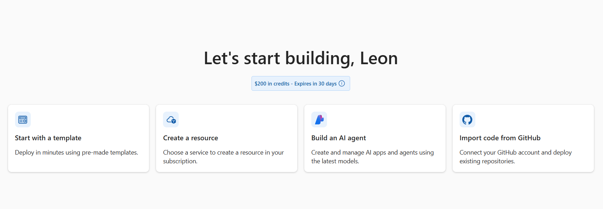

---

## Step 2: Create a resource group

Next, I created a resource group called `rg-sentinel-lab`.

**Why this mattered:**  
This kept all of the lab resources in one place so it stayed organized and easier to manage.

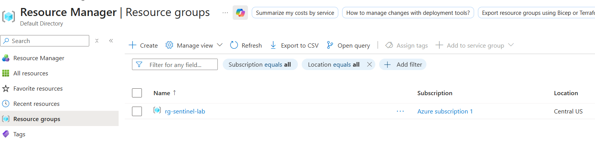

---

## Step 3: Create a Log Analytics workspace

After that, I created the Log Analytics workspace that Sentinel would use.

**Why this mattered:**  
This is where the logs land so they can be searched, queried, and used for alerts.

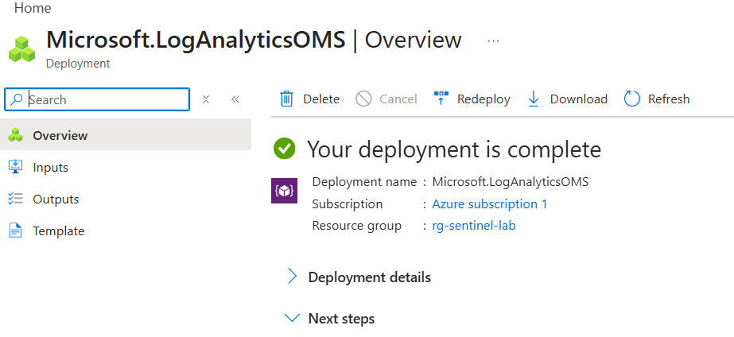

---

## Step 4: Add Microsoft Sentinel to the workspace

Once the workspace was ready, I added Microsoft Sentinel to it.

**Why this mattered:**  
This turned the workspace into a SIEM so I could start collecting data and building detections.

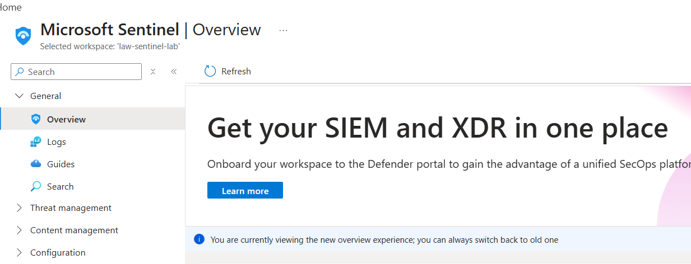

---

## Step 5: Configure diagnostic settings for Azure Activity

I created a diagnostic setting to send Azure Activity logs into the Log Analytics workspace.

**Why this mattered:**  
This let me track Azure-side actions like resource changes, deployments, and management activity.

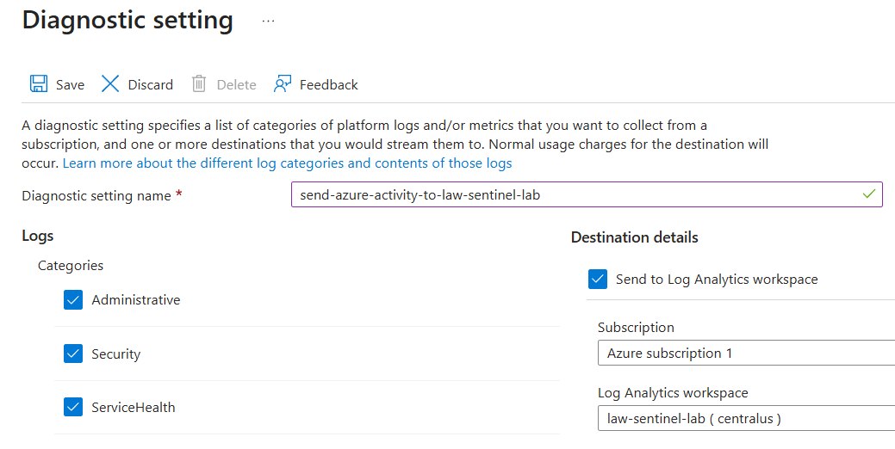

---

## Step 6: Confirm Azure Activity is connected

After the diagnostic setting was in place, I verified that Azure Activity showed as connected.

**Why this mattered:**  
This confirmed that Azure Activity logs were actually being sent into Sentinel.

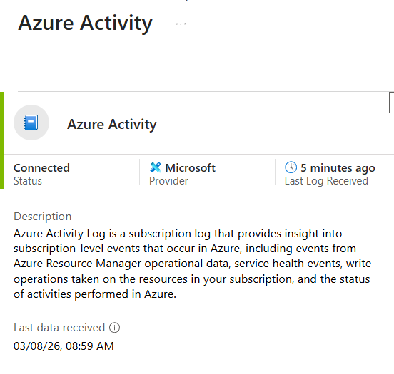

---

## Step 7: Create and verify the Windows VM

Next, I created the Windows VM that I used as the log source for Windows events.

**Why this mattered:**  
This gave me a machine to generate real security events like successful and failed logons.

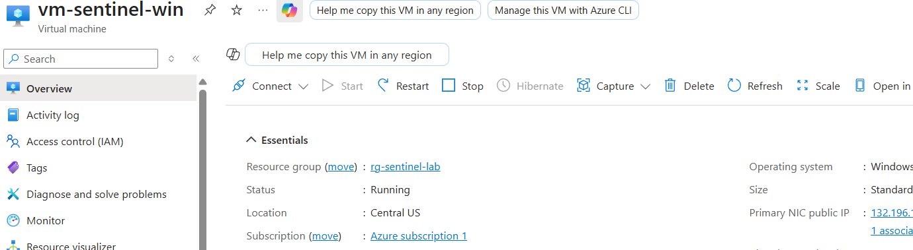

---

## Step 8: Connect to the VM

I connected to the VM through RDP so I could interact with it directly.

**Why this mattered:**  
I needed access to the machine to generate activity and confirm things were working.

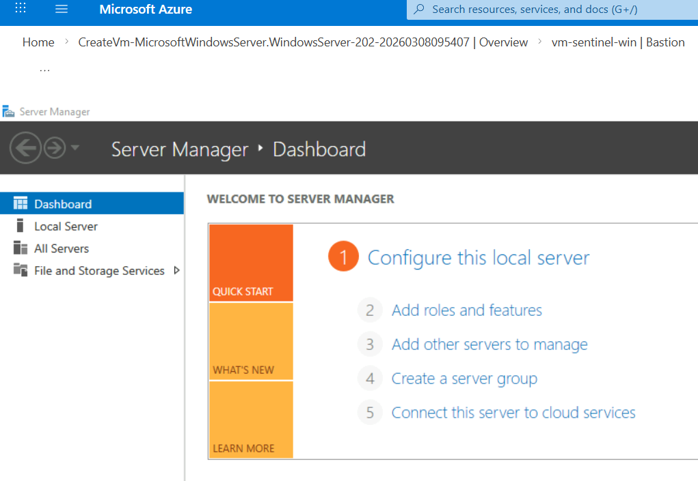

---

## Step 9: Create the data collection rule for Windows Security Events

I created the data collection rule to collect Windows Security logs from the VM.

**Why this mattered:**  
This is what told Azure what log data to pull from the VM and send into Sentinel.

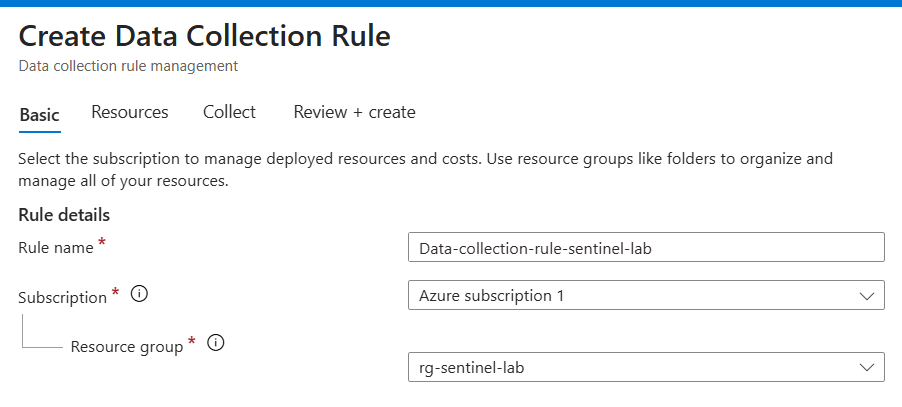

---

## Step 10: Confirm Windows Security Events via AMA is connected

After the data collection rule was created, I checked the connector status.

**Why this mattered:**  
This confirmed that Windows security data collection was in place.

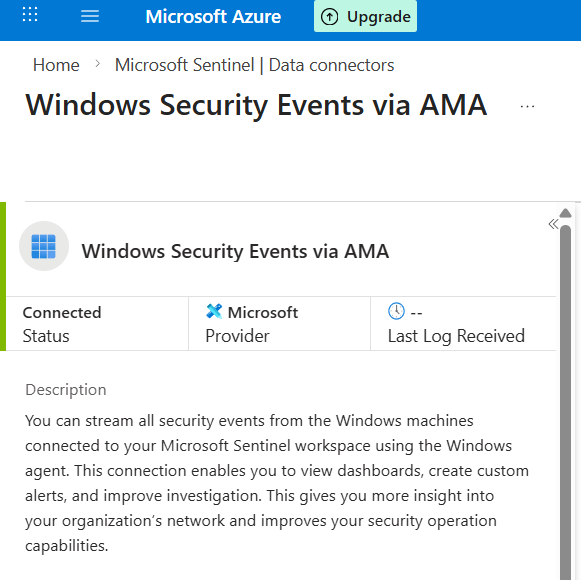

---

## Step 11: Verify Azure Activity logs are arriving

Once ingestion was set up, I ran a query against the `AzureActivity` table.

**Why this mattered:**  
This proved that Azure management events were flowing into Sentinel and were searchable.

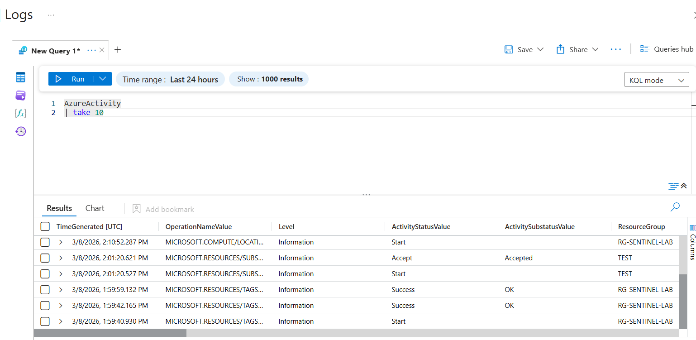

---

## Step 11.1: Verify SecurityEvent logs are arriving

I also checked the `SecurityEvent` table to make sure Windows logs were coming in too.

**Why this mattered:**  
This confirmed the VM was successfully sending security logs into Sentinel.

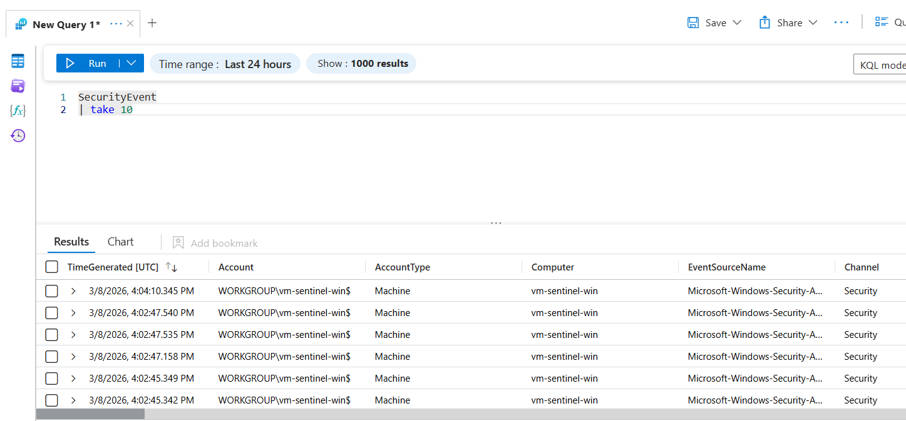

---

## Step 12: Create another user on the VM

I created another local user account on the VM.

**Why this mattered:**  
This gave me another way to generate account-related events for testing.

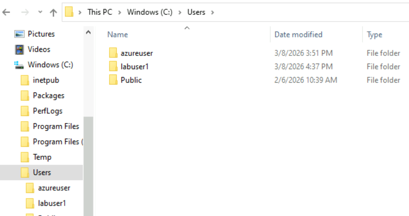

---

## Step 13: Generate failed logon attempts

I intentionally created failed login attempts and then searched for Event ID `4625`.

**Why this mattered:**  
This let me test for failed authentication activity and build a detection around it.

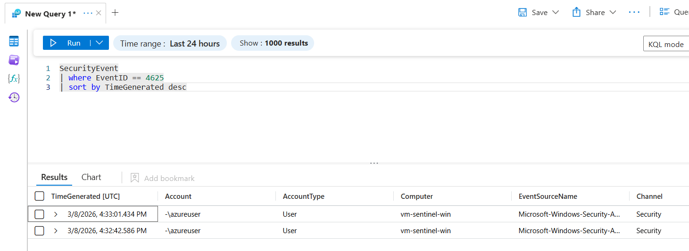

---

## Step 14: Verify successful logons

I searched for Event ID `4624` to confirm successful logon activity was also being captured.

**Why this mattered:**  
This helped show both sides of authentication activity in the environment.

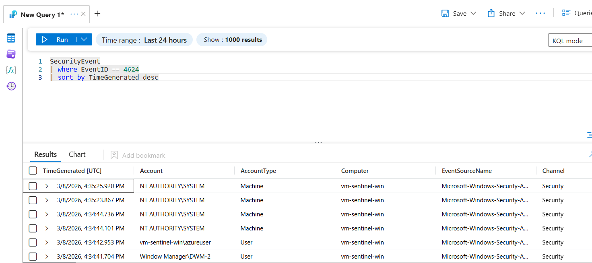

---

## Step 15: Verify account creation events

I searched for Event ID `4720` to confirm account creation logs were also present.

**Why this mattered:**  
This showed that account management activity was being captured too, not just logons.

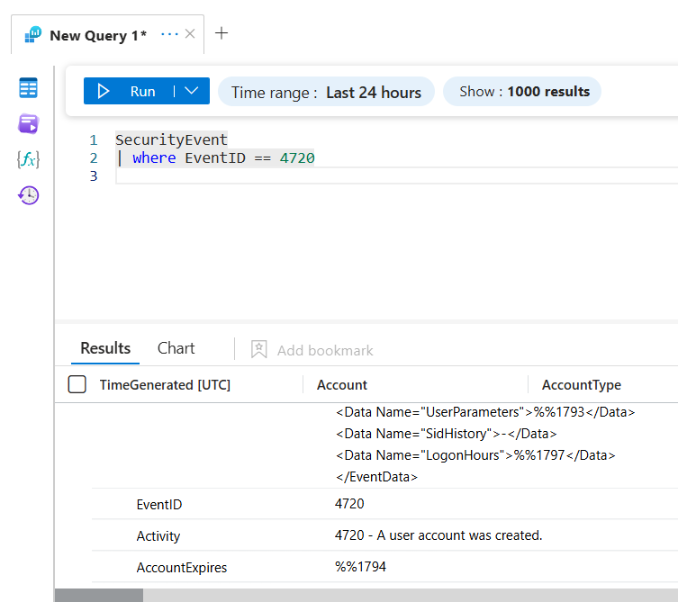

---

## Step 16: Review Azure management events

I ran another Azure Activity query to review management operations happening in the subscription.

**Why this mattered:**  
This helped show the cloud side of the lab alongside the Windows side.

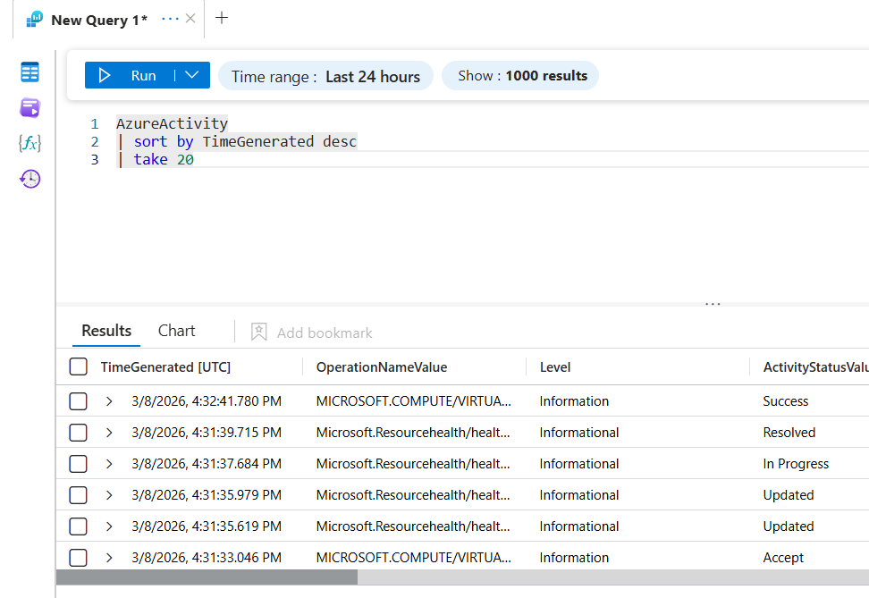

---

## Step 17: Review available analytics rule templates

Once the logs were flowing, I checked the available analytics rule templates in Sentinel.

**Why this mattered:**  
This gave me built-in detection options I could use without starting from scratch.

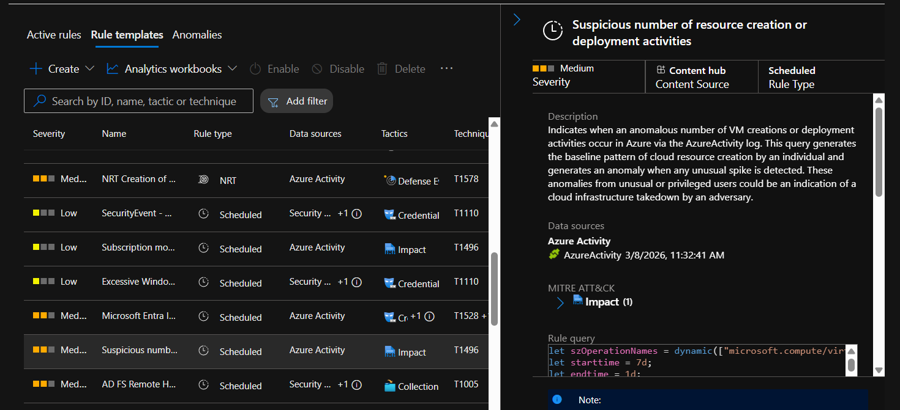

---

## Step 18: Enable a built-in Azure Activity rule template

I enabled a built-in rule template for suspicious Azure resource creation or deployment activity.

**Why this mattered:**  
This gave me a ready-made Azure-focused detection tied to the `AzureActivity` data source.

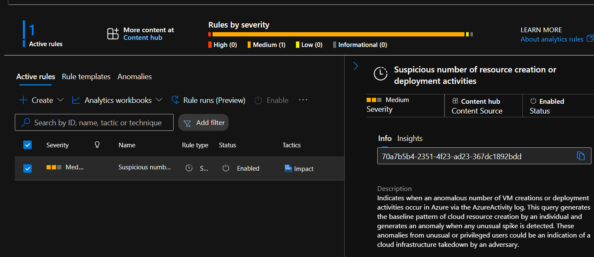

---

## Step 19: Create a custom failed logon rule

I created a custom scheduled rule called **Failed Logons from same account** using Event ID `4625`.

**Why this mattered:**  
This was my own custom detection instead of only relying on built-in content.

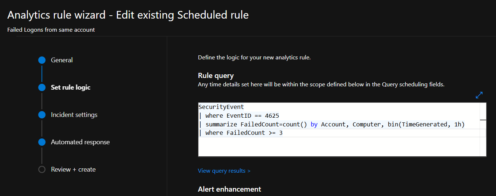

---

## Step 19.1: Confirm the custom rule is active

After creating it, I confirmed the rule showed as enabled in Sentinel.

**Why this mattered:**  
This verified the custom detection was active and ready to trigger.

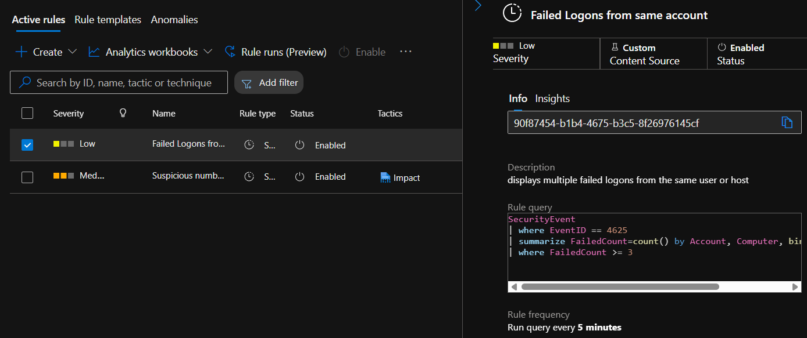

---

## Step 20: Generate alerts from the rule

After more failed login attempts, the rule started generating alerts/incidents.

**Why this mattered:**  
This proved the custom rule logic actually worked and created something I could investigate.

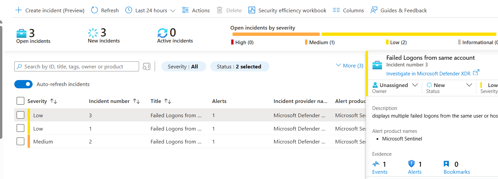

---

## Step 21: Review alert details

I opened the alert details and reviewed the results, including the account, host, and failed count.

**Why this mattered:**  
This is the part that felt most like a real SOC workflow since I was reviewing evidence tied to an alert.

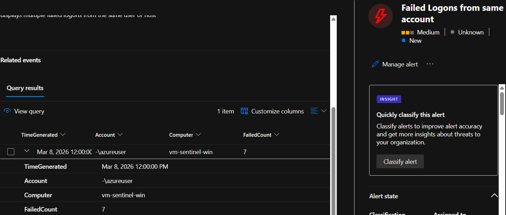

---

## Final result

By the end of the lab, I had:

- Azure Activity logs flowing into Sentinel
- Windows Security Events flowing into Sentinel
- Successful logons, failed logons, and account creation events searchable with KQL
- A built-in analytics rule enabled
- A custom analytics rule created and tuned
- Alerts/incidents generated from failed logon activity
- Alert details reviewed inside Sentinel

## What I learned

This lab helped me get more comfortable with:

- setting up Microsoft Sentinel from scratch
- connecting Azure and Windows log sources
- using Log Analytics and KQL to validate data ingestion
- working with Event IDs like `4624`, `4625`, and `4720`
- creating and enabling analytics rules
- reviewing incidents and alert evidence

## Notes

A big part of this lab was not just turning Sentinel on, but making sure the logs were actually arriving, searchable, and useful.  
I also had to adjust the custom failed logon rule so it would fit a small lab environment and actually generate alerts from the activity I created.
