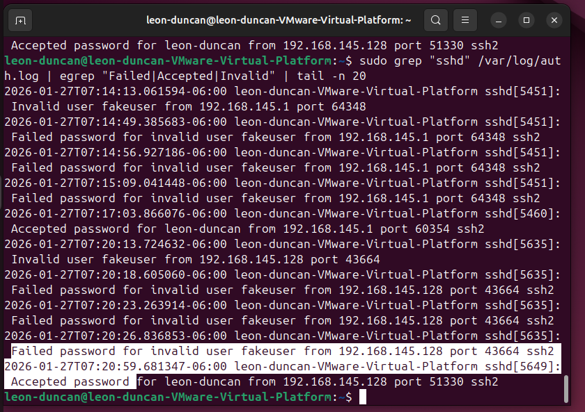

# SSH Login Attempt Tracking Lab (Windows → Ubuntu VM)

## Summary
I connected my Windows laptop to my Ubuntu VM on a **host-only** VMware network (safe/local).  
Then I generated a few **failed SSH logins** and one **successful** login, and used **Wireshark + Ubuntu auth logs** to prove what happened.

---

## Lab setup
**Host:** Windows laptop  
**VM:** Ubuntu (VMware Workstation Pro)  
**Network:** Host-only (VMnet1)

**IPs**
- Windows (VMnet1): `192.168.145.1`
- Ubuntu VM: `192.168.145.128`

**Service tested:** SSH (`tcp/22`)

---

## What I did
- Verified host ↔ VM could talk on the host-only network
- Captured traffic in Wireshark on **VMware Network Adapter VMnet1**
- Attempted SSH logins from Windows → Ubuntu:
  - Multiple failures (wrong username/password)
  - One success
- Checked `/var/log/auth.log` on Ubuntu to confirm outcomes

---

## Mini timeline (what happened)
1) **SSH connection attempt(s)** from `192.168.145.1` → `192.168.145.128` on port `22`  
2) **Failed logins** show up in Ubuntu auth logs (bad user/pass)  
3) **Successful login** shows up as “Accepted password”  
4) Wireshark shows the traffic for the SSH session (encrypted payloads, but clear ports/IPs)

---

## Evidence

### 1) Wireshark filter showing SSH traffic (tcp/22)
**Why it matters:** proves SSH traffic happened between the host and VM on port 22.

---

### 2) Wireshark “Conversations” stats (who talked to who)
**Why it matters:** quick proof of the session endpoints + ports + packet counts.

---

### 3) Ubuntu auth log showing failed + successful logins
**Why it matters:** confirms the *result* of the logins (fail vs success), not just the traffic.

---

## Findings (what the evidence proves)
- SSH traffic occurred from **Windows → Ubuntu** on **tcp/22**
- Ubuntu recorded:
  - **Failed password attempts** (bad username/password)
  - **One successful login** (“Accepted password”)

---

## Conclusion
This lab shows a simple investigation: **packet capture proves the connection happened**, and **system logs prove the login outcome** (failed vs successful).

---

## Next improvements
- Add `fail2ban` to automatically block repeated failed SSH attempts
- Forward auth logs into a SIEM (Splunk/Security Onion) and alert on failed logins

