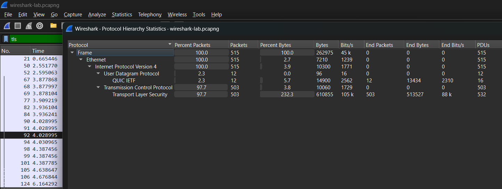

# Wireshark Traffic Lab (DNS + ICMP + HTTP + TLS)

## Quick summary
I used Wireshark to capture normal network traffic from my computer, then used a few filters to find and understand DNS lookups, ping traffic, a simple HTTP request, and encrypted (TLS) traffic.

---

## Tools I used
- Wireshark (Windows)
- A web browser + `ping` (just to generate traffic)

---

## What I did
1. Started a capture on my Wi-Fi connection so Wireshark could “see” traffic going in and out.
2. Let it run for a short time while I did normal stuff (opened a website + ran a ping).
3. Used filters like `dns`, `icmp`, `http`, and `tls` to narrow down what I wanted to look at.
4. Clicked a few packets to see the details Wireshark shows (like IPs, ports, and request/response info).
5. Used a couple built-in stats screens to get a summary of what was captured.

---

## Why I did this
I’m still learning networking, so the goal here was to practice:
- capturing traffic
- filtering it so it’s not overwhelming
- recognizing a few common types of traffic (DNS, ping, web traffic)
- using Wireshark’s stats to get a quick overview

---

## Filters I used (and what they helped me find)
- `dns` — domain lookups (when your computer asks “what IP is this website?”)
- `icmp` — ping traffic (request + reply)
- `http` — non-encrypted web traffic (you can sometimes read parts of it)
- `tls` — encrypted web traffic (common for normal browsing)
- `tcp.stream eq 12` — focuses on one conversation so it’s easier to follow

---

## Screenshots / proof

### 1) Capture running (baseline traffic)
This is the capture running. I saw a lot of “background” traffic too, which seems normal on most networks.

---

### 2) DNS traffic (website lookups)
Filtered to `dns` to see lookups and responses. This is basically how my computer figures out what IP to connect to.

What I noticed:
- There are “question” packets (asking) and “answer” packets (responding)
- Some responses include IP addresses

---

### 3) ICMP traffic (ping)
Filtered to `icmp` to see ping requests and replies.

What I noticed:
- There’s a request and then a reply, back and forth

---

### 4) HTTP traffic (not encrypted)
Filtered to `http` to find a simple web request.

Why this stood out:
- HTTP can sometimes show readable info (unlike encrypted traffic)

---

### 5) Follow TCP Stream (see the conversation)
I used Wireshark’s **Follow → TCP Stream** to view the request/response in an easier format.

Why I used it:
- It puts the conversation together so it’s easier to understand than clicking packets one-by-one

---

### 6) TLS traffic (encrypted)
Filtered to `tls` to see encrypted traffic.

What I noticed:
- You can still see who is talking to who, but not the actual content (because it’s encrypted)

---

### 7) Protocol Hierarchy (overall summary)
I used **Statistics → Protocol Hierarchy** to see a quick breakdown of what kinds of traffic were in the capture.

---

### 8) Conversations (who talked the most)
I used **Statistics → Conversations** to see which connections had the most activity.

Why I checked this:
- It helps show the “main” connections without having to scroll through everything

---

## Privacy note
I didn’t upload the full `.pcapng` file because packet captures can include private info. Screenshots are enough to show what I did without exposing sensitive data.

